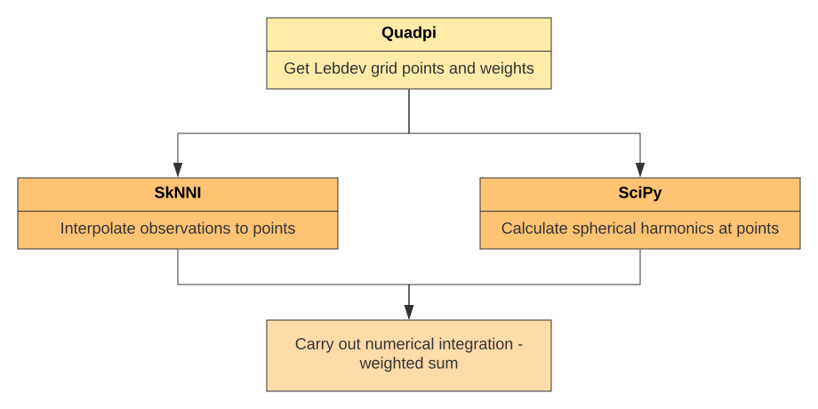

# SPHARMFIT - Spherical Harmonic Fitting of crystal voids
----------------------

Python package for deriving shape descriptors of voids in organic crystal structures.

The algorithm relies on spherical nearest neighbour interpolation and numerical integration on the surface of the sphere.

It is reliant on the following Python packages:
* [`trimesh`](https://pypi.org/project/trimesh/) - Ppure Python library for loading and using triangular meshes
* [`pyglet`](https://pypi.org/project/pyglet/) - Cross-platform windowing and multimedia library
* [`quadpy`](https://pypi.org/project/quadpy/) - Numerical integration, quadrature for various domains
* [`sknni`](https://pypi.org/project/sknni/) - spherical k-nearest neighbors interpolation and is a geospatial interpolator

## Integration scheme:

The surface integral of a function over the unit sphere,

$$
  I[f] = \int d\Omega f(\Omega) = \int_0^{\pi} sin(\theta) \int_0^{2\pi} d \phi\ f(\theta \phi)
$$

is approximated in the Lebdev scheme as:

$$
  \tilde{I}[f] = 4\pi \sum_{i=1}^{N} w_i f(\theta_i \phi_i)
$$

## Program execution:
  1. `Loader.py` responsible for `mesh` loading. From the mesh `mesh.vertices.T` provide the necessary cartesian coordinates of the relevant surface points.
  2. Surface points are then processed by `projector.py`. This is a two-step process:
    1. `project(xyz)` project points onto the unit sphere. The radial extension is the dependent variable for our spherical function.
    2. `mk_obsrv` converts the Cartesian unit sphere point collection representaion to its spherical coordinate couterpart.
  3.  The Lebdev grid coordinates are then generated by the `get_lebdev_grid()` in `lebdev_grid.py`.

## Convention disparities

All packages employed use a spherical-coordinate representation of the sample points. The convention for spherical coordinattes is, however poorly defined in both the notation and the defined bounds.

The physics (__ISO__) convention, is defined as $(r,\theta,\phi)$ for radial distance, polar and azimuthal angles respectively, as shown in the figure.

The mathematical version, also denoted $(r,\theta,\phi)$ exchanges polar and azimuthal angles. Azimuth ($\theta$) is given first, followed by the polar angle ($\phi$).

The azimuth is often restricted to the interval (−180°, +180°], or (−π, +π] in radians, instead of [0, 360°). This is the standard convention for geographic longitude. The range [0°, 180°] for inclination is equivalent to [−90°, +90°] for elevation (latitude).

We present the notations and boundary conditions for each package employed:

| Package   | Angle ordering      | Bounds                                            |
|-----------|---------------------|-------------------------------------------------- |
| `Quadpi`  | (azimuthal, polar)  |$([-180^\circ, 180^\circ], [0^\circ,180^\circ])$   |
| `skNNI`   | (polar, azimuthal)  |$([-90^\circ, 90^\circ), [-180^\circ,180^\circ))$  |
| `SciPy`   | (azimuthal, polar)  |$([0^\circ, 360^\circ],[0,^\circ180^\circ])$       |

Evidently, there is total disagreement between packages. The points of interest are generated by `quadpi` and are subsequently passed to `skNNI` and `SciPy`:

Therefore, both the skNNI and SciPy function calls are wrapped by a function that preprocess the angular data to correct for the correct boundaries.
